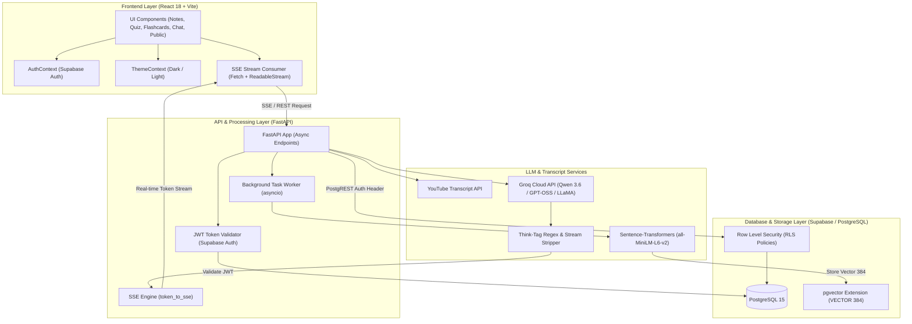

# 📚 YouTube AI Lecture Notes & Study Assistant

An end-to-end, AI-powered study platform that transforms any YouTube lecture or educational video into structured academic notes, interactive multi-topic quizzes, study flashcards, concise summaries, and a conversational RAG (Retrieval-Augmented Generation) assistant.

---

## 🌟 Key Features

- **⚡ Real-Time Note Streaming (SSE)**: Streams markdown lecture notes live as they are generated using Server-Sent Events.
- **🌐 Multi-Language Support**: Choose your preferred language style:
  - **English**: Formal technical documentation and breakdowns.
  - **Hindi**: Clean Devanagari script with English technical terms.
  - **Hinglish**: Natural colloquial blend with definitions, real-world examples, and interview focus.
- **🧠 Per-Topic Interactive Quizzes**: Generates 3–4 multiple-choice questions for each topic in the lecture notes, complete with instant color-coded feedback and explanations.
- **📋 3D Study Flashcards**: Interactive flip-cards with progress tracking, question-and-answer views, and "Mark as Known" counters.
- **📊 Instant Summaries**: Creates a concise, structured bulleted summary of key lecture takeaways.
- **💬 RAG Conversational Chat**: Ask questions about your saved notes and receive grounded, accurate answers backed by PostgreSQL `pgvector` semantic search.
- **🏷️ Tagging & Full-Text Search**: Organize notes with custom tags and search titles and note contents.
- **🔗 Public Note Sharing**: Generate public shareable links (`/shared/:shareId`) that can be viewed by anyone without requiring a login.
- **🌙 Dark & Light Mode**: Smooth theme toggling with zero flicker and full CSS variable styling.
- **🛡️ Multi-Model Groq Failover**: Model selector on the frontend with automatic backend failover (`qwen/qwen3.6-27b` &rarr; `openai/gpt-oss-20b` &rarr; `qwen/qwen3.8-27b` &rarr; `openai/gpt-oss-120b`) to handle free-tier rate limits.

---

## 🏗️ System Architecture



---

## 📁 Repository Structure

```plaintext
yt-lecture-notes/
├── backend/
│   ├── .env                    # Environment variables (API keys, Supabase credentials)
│   ├── .env.example            # Environment template
│   ├── auth.py                 # Supabase JWT token verification & auth dependencies
│   ├── db.py                   # Supabase CRUD operations (notes, chunks, messages, tags)
│   ├── dependencies.py         # LLM provider settings & configuration
│   ├── llm.py                  # Multi-model streaming, think-tag filter & fallback logic
│   ├── main.py                 # FastAPI app, SSE endpoints, RAG, Quiz, Summary, Flashcards
│   ├── rag.py                  # RAG embeddings (sentence-transformers), chunking & similarity
│   ├── requirements.txt        # Python backend dependencies
│   ├── sse.py                  # Server-Sent Events (SSE) streaming helpers
│   ├── transcript.py           # YouTube transcript fetcher & timestamp processor
│   ├── utils.py                # Token counter & chunk splitting utilities
│   └── Procfile                # Production startup script for Render / Railway
│
├── frontend/
│   ├── package.json            # Node.js dependencies & scripts
│   ├── vite.config.js          # Vite build & server configuration
│   ├── vercel.json             # Single Page Application (SPA) routing rules for Vercel
│   ├── index.html              # HTML entry point
│   └── src/
│       ├── main.jsx            # React root entry point with CSS import
│       ├── App.jsx             # Main router, navigation bar & landing page
│       ├── config.js           # Dynamic API base URL resolution
│       ├── index.css           # Global theme transitions, dark & light mode styles
│       ├── components/
│       │   ├── AuthModal.jsx       # Google OAuth & Email/Password modal
│       │   ├── NoteGenerator.jsx   # YouTube URL input, model & language picker, note stream
│       │   ├── MyNotes.jsx         # Saved notes library with search, tags & tab switcher
│       │   ├── QuizPanel.jsx       # Per-topic 3-4 MCQ interactive quiz & score tracker
│       │   ├── FlashcardPanel.jsx  # Interactive study flip-cards & progress tracker
│       │   ├── ChatPanel.jsx       # RAG-based AI chat with saved notes
│       │   └── PublicNote.jsx      # Public shared note view (accessible without login)
│       ├── context/
│       │   ├── AuthContext.jsx     # Supabase Auth provider (login, signup, session state)
│       │   └── ThemeContext.jsx    # Dark / Light theme provider (localStorage persisted)
│       ├── lib/
│       │   └── supabase.js         # Supabase JS client configuration
│       └── utils/
│           └── api.js              # SSE streaming fetch wrappers
│
├── render.yaml                 # Infrastructure as Code (IaC) configuration for Render
├── supabase_schema.sql         # Base PostgreSQL schema (notes, chunks, pgvector, RLS)
├── supabase_migration_v2.sql   # Migration for tags, language, and public share links
└── README.md                   # Project documentation
```

---

## 🛠️ Tech Stack

- **Frontend**: React 18, Vite, React Router 6, ReactMarkdown, remark-gfm.
- **Backend**: FastAPI (Python 3.10+), Uvicorn, AsyncIO, SSE (Server-Sent Events).
- **AI & LLMs**: Groq Cloud API (`qwen/qwen3.6-27b`, `openai/gpt-oss-20b`, `qwen/qwen3.8-27b`, `openai/gpt-oss-120b`).
- **Vector Embeddings**: `sentence-transformers` (`all-MiniLM-L6-v2`, 384 dimensions).
- **Database & Auth**: Supabase PostgreSQL with `pgvector` extension and Row Level Security (RLS).

---

## ⚡ Quick Start (Local Setup)

### 1. Prerequisites
- **Python 3.10+**
- **Node.js 18+** & npm
- **Supabase Account** (Free tier)
- **Groq Cloud API Key** (Free tier from [console.groq.com](https://console.groq.com))

---

### 2. Database Setup (Supabase)
1. Create a new project in [Supabase](https://supabase.com).
2. Open the **SQL Editor** in your Supabase dashboard and run:
   - `supabase_schema.sql` (Creates tables, pgvector extension, and RLS policies).
   - `supabase_migration_v2.sql` (Adds tags, language, and public share support).

---

### 3. Backend Setup

1. Navigate to the backend folder:
   ```bash
   cd backend
   ```
2. Create and activate a virtual environment:
   ```bash
   python -m venv venv
   # On Windows:
   venv\Scripts\activate
   # On Linux/macOS:
   source venv/bin/activate
   ```
3. Install dependencies:
   ```bash
   pip install -r requirements.txt
   ```
4. Create a `.env` file inside `backend/` based on `.env.example`:
   ```env
   LLM_PROVIDER=groq
   GROQ_API_KEY=your_groq_api_key_here
   GROQ_MODEL=qwen/qwen3.6-27b

   SUPABASE_URL=https://your-project.supabase.co
   SUPABASE_ANON_KEY=your_supabase_anon_key
   SUPABASE_JWT_SECRET=your_supabase_jwt_secret

   MAX_TRANSCRIPT_TOKENS=1800
   CORS_ORIGIN=http://localhost:5173
   ```
5. Start the backend development server:
   ```bash
   python -m uvicorn main:app --reload --port 8000
   ```
   Backend will be live at: `http://localhost:8000`

---

### 4. Frontend Setup

1. Open a new terminal and navigate to the frontend folder:
   ```bash
   cd frontend
   ```
2. Install node dependencies:
   ```bash
   npm install
   ```
3. Create a `.env` file inside `frontend/`:
   ```env
   VITE_API_BASE=http://localhost:8000
   VITE_SUPABASE_URL=https://your-project.supabase.co
   VITE_SUPABASE_ANON_KEY=your_supabase_anon_key
   ```
4. Start the Vite dev server:
   ```bash
   npm run dev
   ```
   Frontend will be live at: `http://localhost:5173`

---

## 🚀 Deployment Guide (100% Free)

### Deploy Backend to Render
1. Go to [Render.com](https://render.com) &rarr; **New &rarr; Web Service**.
2. Connect your GitHub repository.
3. Configure settings:
   - **Root Directory**: `backend`
   - **Runtime**: `Python 3`
   - **Build Command**: `pip install -r requirements.txt`
   - **Start Command**: `uvicorn main:app --host 0.0.0.0 --port $PORT`
4. Add your Environment Variables (`GROQ_API_KEY`, `SUPABASE_URL`, `SUPABASE_ANON_KEY`, `SUPABASE_JWT_SECRET`, etc.).
5. Copy your live backend URL (e.g. `https://yt-notes-backend.onrender.com`).

### Deploy Frontend to Vercel
1. Go to [Vercel.com](https://vercel.com) &rarr; **Add New &rarr; Project**.
2. Import your GitHub repository.
3. Set **Root Directory** to `frontend`.
4. Add Environment Variables:
   - `VITE_API_BASE` = `https://yt-notes-backend.onrender.com`
   - `VITE_SUPABASE_URL` = `https://your-project.supabase.co`
   - `VITE_SUPABASE_ANON_KEY` = `your_anon_key`
5. Click **Deploy**.

---

## 🔒 Security & Data Privacy

- **Row Level Security (RLS)**: Users can strictly access only their own saved notes, vector chunks, and chat history.
- **Client-Scoped PostgREST**: The backend resolves authenticated actions using the user's Supabase JWT token.
- **Protected Environment Variables**: `.env` files are ignored by git; API keys and secrets are never committed.

---

## 📄 License
This project is open-source and available under the [MIT License](LICENSE).
